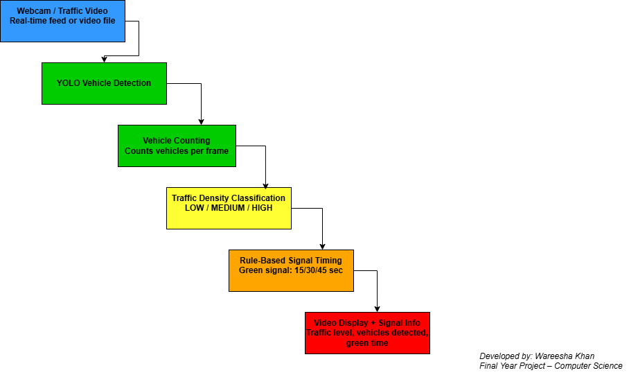

# AI-Based Smart Traffic Management System 🚦

## 📌 Project Overview
This Final Year Project presents an AI-based Smart Traffic Management System that dynamically controls traffic signals based on real-time vehicle density using computer vision and deep learning.

The system uses YOLO (You Only Look Once) for vehicle detection and applies rule-based logic to adjust traffic signal timing efficiently.

---

## 🎯 Problem Statement
Traditional traffic signals operate on fixed timers, causing unnecessary congestion and delays. This project aims to reduce traffic congestion by dynamically adjusting signal timing according to real-time traffic conditions.

---

## 🛠 Technologies Used
- Python
- OpenCV
- YOLOv8 (Ultralytics)
- Computer Vision
- Rule-Based Decision Logic
- GitHub (Version Control)

---

## 🧠 System Architecture


---

## 📅 Day-wise Progress

### ✅ Day 1 – Camera & Environment Setup
- Python virtual environment setup
- OpenCV camera/video test


---

### ✅ Day 2 – Vehicle Detection (Basic)
- Vehicle detection using OpenCV
- Vehicle counting implemented


---

### ✅ Day 3 – Smart Signal Timing Logic
- Traffic density classified as LOW / MEDIUM / HIGH
- Rule-based signal timing implemented


---

### ✅ Day 4 – YOLO Vehicle Detection
- YOLOv8 model integrated
- Accurate vehicle detection with bounding boxes


---

### ✅ Day 5 – Smart Signal + YOLO Integration
- Real-time vehicle counting using YOLO
- Dynamic signal timing based on traffic density
- Complete AI-based smart traffic control demonstrated


---

## ▶️ How to Run the Project

```bash
# Activate virtual environment
venv\Scripts\activate

# Install dependencies
pip install -r requirements.txt

# Run Day 5 smart system
python src/day5_smart_signal_yolo.py

## 🧠 System Architecture

